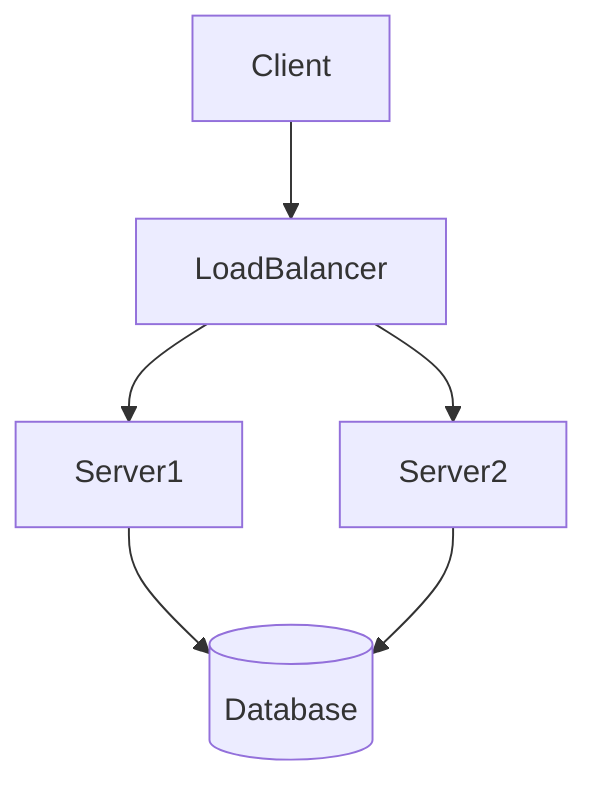
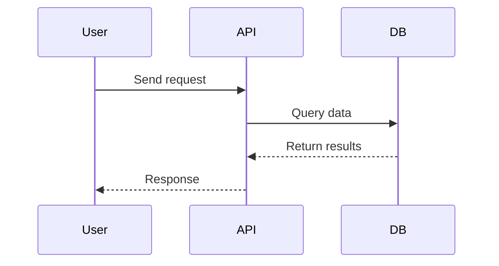
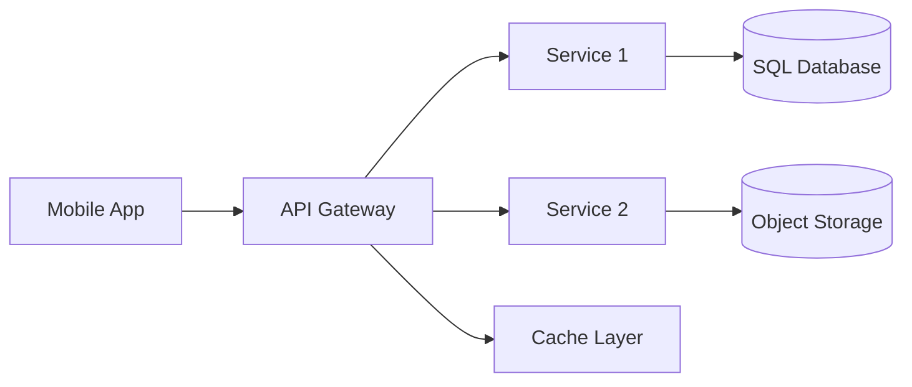

# Chapter X: [Title of the Chapter]

## 1. Overview
- What this concept is about
- Why it matters in **modern system design**
- Example: “Load balancing ensures no single server becomes a bottleneck.”

---

## 2. Key Concepts
- 🔹 Concept 1 → short explanation
- 🔹 Concept 2 → short explanation
- 🔹 Concept 3 → short explanation

---

## 3. Trade-offs & Challenges
- ✅ Pros: scalability, performance, reliability
- ⚠️ Cons: cost, complexity, latency
- Example: “CDN improves latency but adds cost and cache invalidation issues.”

---

## 4. Interview Angle
**Common Questions:**
- “How would you design X at scale?”
- “What are the bottlenecks in Y?”
- “What’s the difference between A vs B?”

**Answer Structure (STAR method):**
1. Requirements  
2. Constraints  
3. High-Level Design  
4. Trade-offs  

---

## 5. Diagrams

### 🔹 Flowchart Example

---

### 🔹 Sequence Diagram Example

---

### 🔹 Architecture Block Example

---

